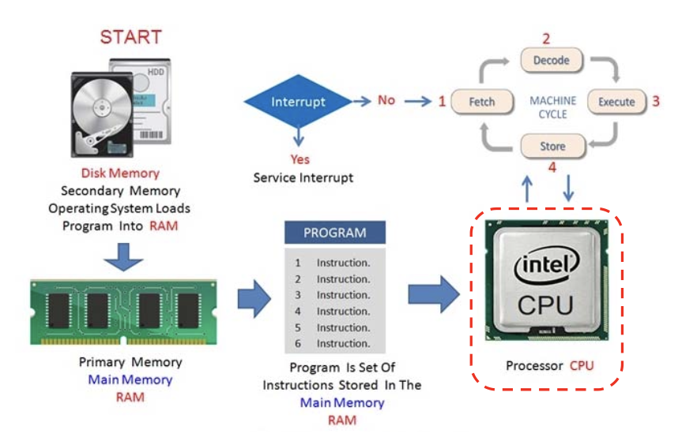
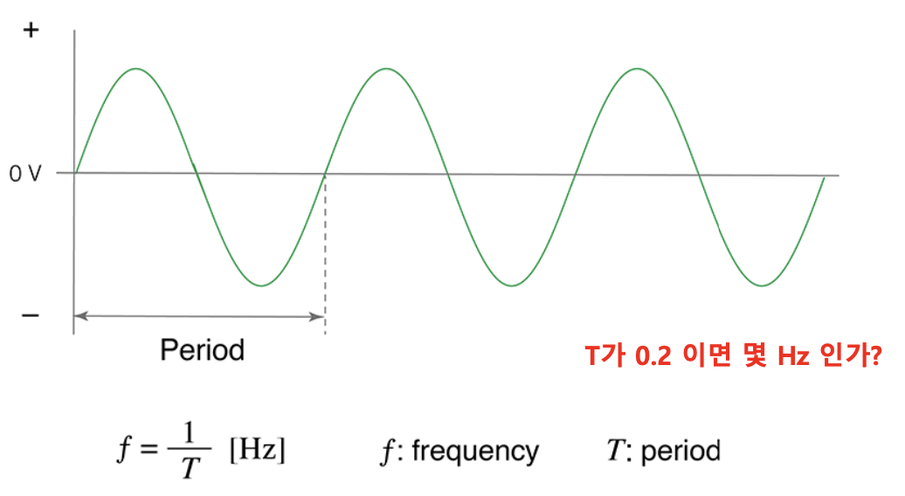
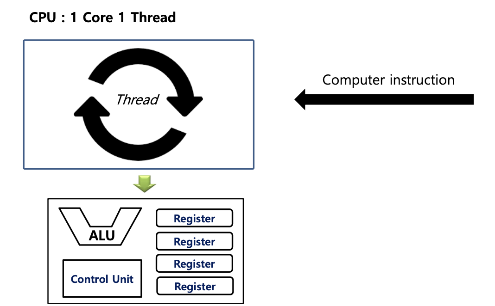
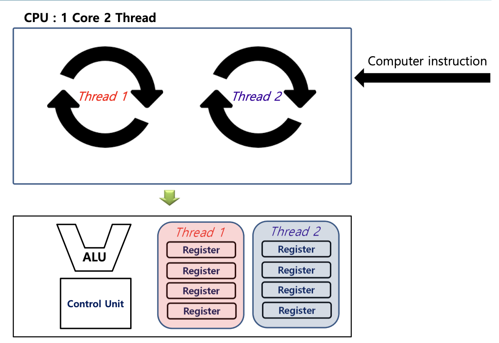
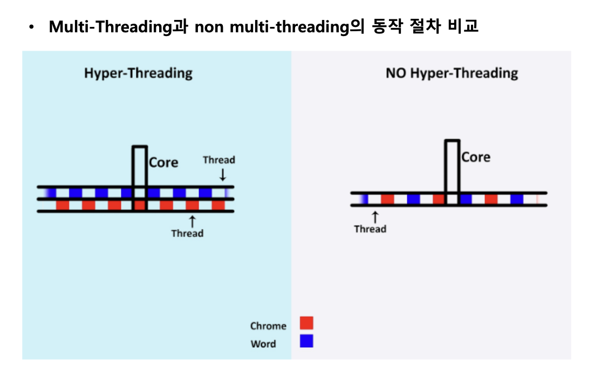
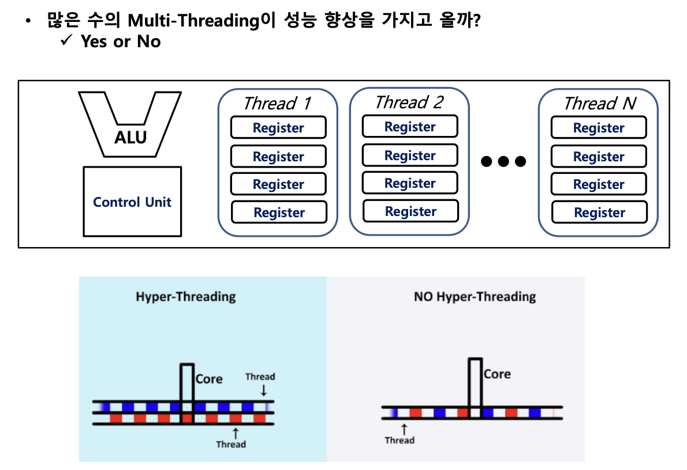

### CPU(중앙처리장치)
---
> ♣︎ CPU란
  - 컴퓨터 명령어(Computer Instruction)를 해석 및 실행하는 장치
  - 우리들이 작성한 모든 프로그램은 CPU에 의해서 해석 실행됨

> ♣︎ Machine Cycle(머신사이클)
- Machine cycle은 CPU가 하나의 컴퓨터 명령어를 실행하는 주기
 

- ***Machine cycle은 4가지 상태로 구성***
1. **Fetch : 컴퓨터 명령어(Computer Instruction)을 메모리로부터 적재(Register)**
2. **Decode : 컴퓨터 명령어 해석**
3. **Execute : 해석된 명령어를 실행**
4. **Store : 실행된 결과 값을 메모리 또는 레지스터에 저장**

---
> ♣︎ CPU SPEC

---

> ♣︎ CPU Clock Speed
- CPU Clock Speed - 발전기

- CPU Clock Speed or Clock Rate은 CPU 내부에서 각 장치들 간의 동기화(Synchronization)를 위해 발생하는 Clock Signal의 주기(Frequency)를 의미한다
 

- Clock Signal(Pulse)
  - 디지털 회로에서 High and Low 값이 주기적으로 나타나는 신호를 의미

- CPU Clock Speed의 단위
  - Hertz[Hz] : 헤르츠
    - 1 Hz는 "1초에 한 번" 의미

- 기본 클럭이 3.0GHz인 CPU인 경우, 기본 클럭 모드로 동작 시 1초에 30억번 정도 동작(1GHz(기가헤르츠)는 1,000MHz)
 

> ♣︎ 최근 CPU 제조사들의 신제품 발매 시 Clock Speed 향상 속도가 더딘이유
- CPU의 클럭 속도가 빠르면 처리 속도도 높아지는가?
  - Yes and NO
 

- 여러가지 문제점들
1. 발열 문제(Heating Problem)
   - Clock 속도가 높을 수록 높은 발열 발생
   - CPU의 적정 온도는 40~70(일반적)
   - 각 CPU마다 최대 허용 온도가 설정되어 있음
2. 전력 소비(Power Consumption)
   - CPU 성능을 높이기 위해서는 보다 많은 전력 소비가 필요
   - 최근 CPU의 요구사항 중 하나인 Mobility 문제 직면
   - 또한 많은 전력 소비는 발열 문제로 이어짐 
3. CPU 칩의 물리적 제한
   - 높은 Clock Speed로 동기화가 이루어 진다면, 아에 따른 에러율도 증가한다.
4. 수확체감의 법칙 문제 발생(Problem of the law of diminishing returns)
   - CPU Clock Speed와 시스템 성능 향상 관계가 Linear 하지 않다.

다른 접근 방법이 필요!!

> ♣︎ CPU 성능 향상 방안
- Clock Speed
- Multi-Core
- Multi-Thread
  - Hyper-Threading(intel), SMT(AMD)
- parallel instruction processing
- Cache memory
- So on!!

> ♣︎ Single core vs Multi core
- 코어의 개수가 여러개라서 동시처리 가능(ex.게임과 게임방송 송출을 동시에 하는것)

코어 수가 많다고 무조건 좋은건 X(코어가 2개인데 해야할 작업이 1개이면 1개의 코어가 놀수있다)

> ♣︎ 멀티 쓰레드
- 하나의 Core 안에서 명령어 처리를 관리하는 단위
- Thread = 일꾼
- 하나의 코어에는 반드시 한개의 Thread가 존재함

쓰레드는 많이 있어도 동시동작을 하지 않는다
