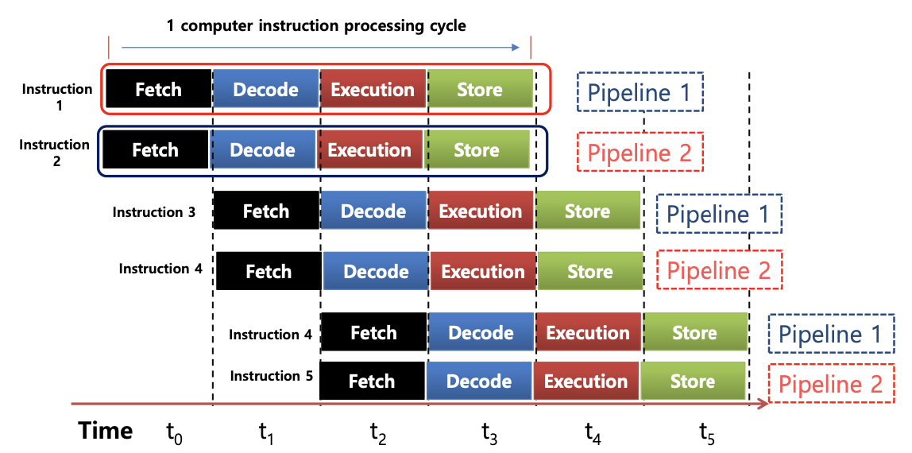
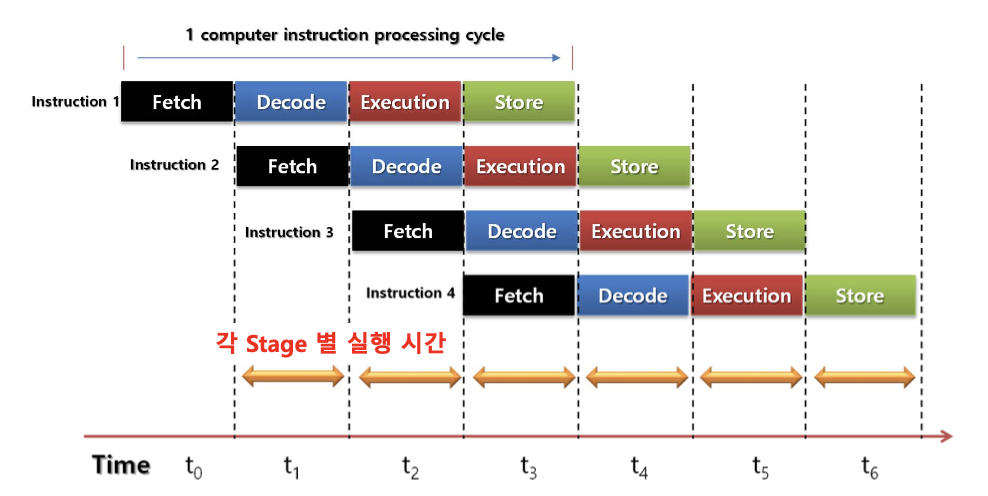

### 명령어 처리 방법 개선을 통한 성능 향상
---
- 컴퓨터 성능 향상을 위해 컴퓨터 명령어를 병렬로 처리하는 기법 제공

일열로 쭉 실행하면 시간이 많이 소요됨

CPU에서 위의 두개의 명령 처리 시간을 줄이는 방법은?

> ♣︎ 명령어 파이프라인(Instruction PipeLine)
- 명령어를 수행하기 위해 프로세서에 의해 취해진 산술적인 단계가 연속적이고, 다소 겹쳐서 수행하는 것을 의미

> ♣︎ 컴퓨터 명령어를 파이프 라인으로 샤용하면 일어나는 문제점
- Data Hazard
  - 명령어들 간의 데이터 의존성 문제
- Control Hazard
  - 현 실행 명령어의 분기로 인해 효율성 저하
- Structural Hazard(Resourced Harzard)
  - 명령어들이 겹쳐 실행되는 과정에서 동시간 동일 CPU부품 사용
 

명령어가 아직 다 실행이 안된 상태에서 다음 명령어를 실행하기위한 값이 안들어 왔기떄문에 값이 달라질수 있음

분기로 인해서 미리 실행된 명령어가 무의미해질 수 있음

가로: 시간, 세로: 명령어

동일한 시간에 동일한 명렁어가 쓰이면 충돌 (t4, t5)

> ♣︎ 슈퍼스칼라(Superscalar)
- 명령어 실행 파이프 라인을 복수개로 확장

> ♣︎ 비순차적 명령어 처리 [Out-of-order execution]
- 파이프라인을 이용
- 명령어 실행 순서 변경

out -of-order: 합법적인 새치기

명령 순서를 뒤바꾼다.

> ♣︎ 병렬 명령어 처리 기법에 대한 고찰
- 병령 명령어 처리 기법을 이용하여 동시에 다수개의 명령어를 실행함으로 컴퓨터 명령 처리 속도를 높일 수 있다 하지만 앞서 설명한 Resource, Control and Resource harzard 문제점을 안고 있다 또한 
명령어 실행 단계별 주기가 일정하지 않을 경우 여러 문제점을 가지고 있다.

