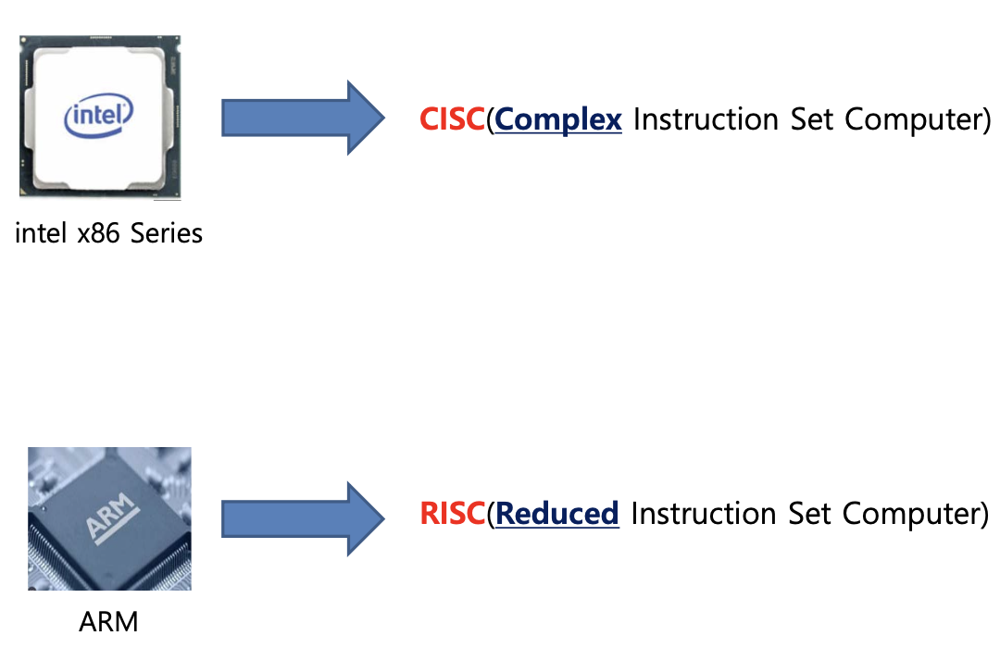

### ISA(Instruction Set Architecture)

---

> ♣︎ ISA

- CPU가 이해할 수 있는 명령어들의 모음을 ISA(Instruction Set Architecture)라 한다.

ISA가 다르기 때문에 서로 다른 명령어가 나온것을 볼 수 있다

Window 어플리케이션을 MAC(ARM 기반)에서 실행하지 못하는 이유 중 하나!

> ♣︎ intel vs ARM

> ♣︎ CISC vs RISC 분석

- CISC는 복잡하고 **다양한 명령어**들을 가지고 있다.
  - 다양한 명령어를 갖춘 JSA를 구축하려면 CPU 내 보다 많은 트랜지스터가 소요된다.
- 다양한 명령어들을 처리하기 위해 **각 명령어의 길이가 가변적**이다

  - 파이프라인 명령어 처리에 있어 치명적인 약점을 가지고 있다.
  

- RISC는 자주 사용되는 단순한 명령어들로 구성 되어 있음
- 즉 CISC 보다 적은 수의 ISA를 구성
  - ARMv8: 143 instructions
  - intel i-9: over 2,000 instructions
- 연구결과 CISC ISA 중 약 20%가 주로 사용됨
- 짧고 규격화된 명령어를 지향
- 프로그램 사이즈가 CISC 대비 크다

- 짧고(1 클럭 내외) 규격화된 명령어 사용으로 파이프라인 기법 적용에 용이

