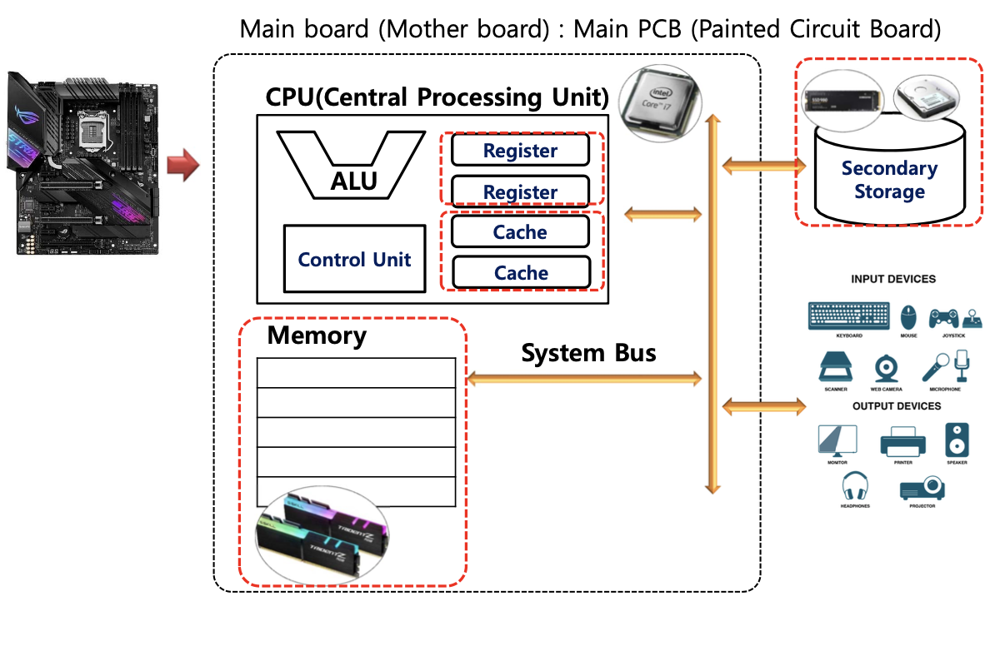
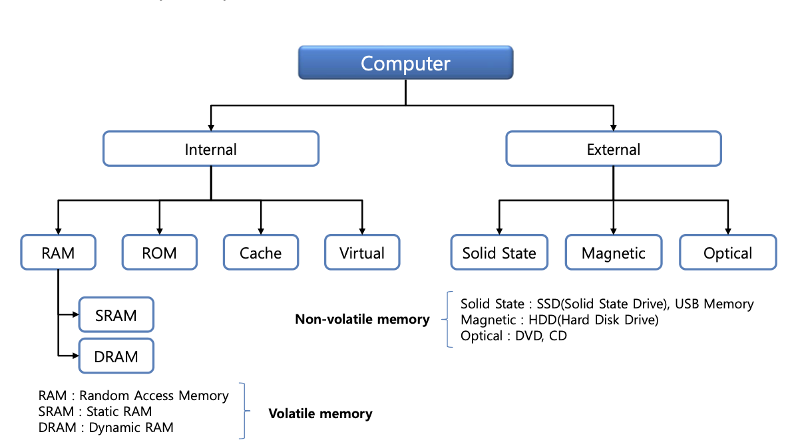
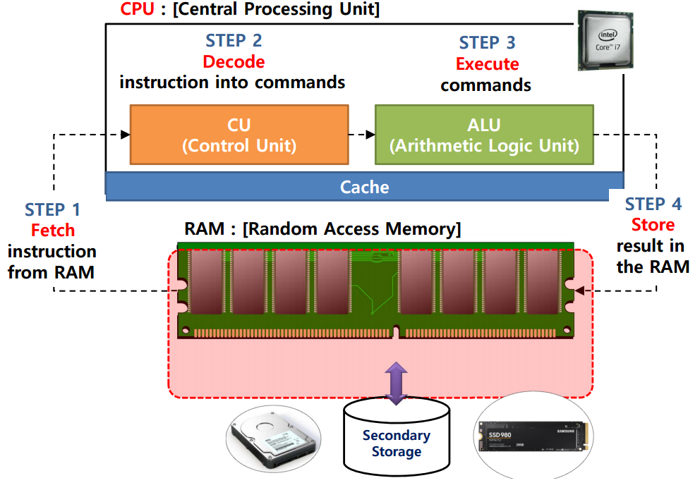
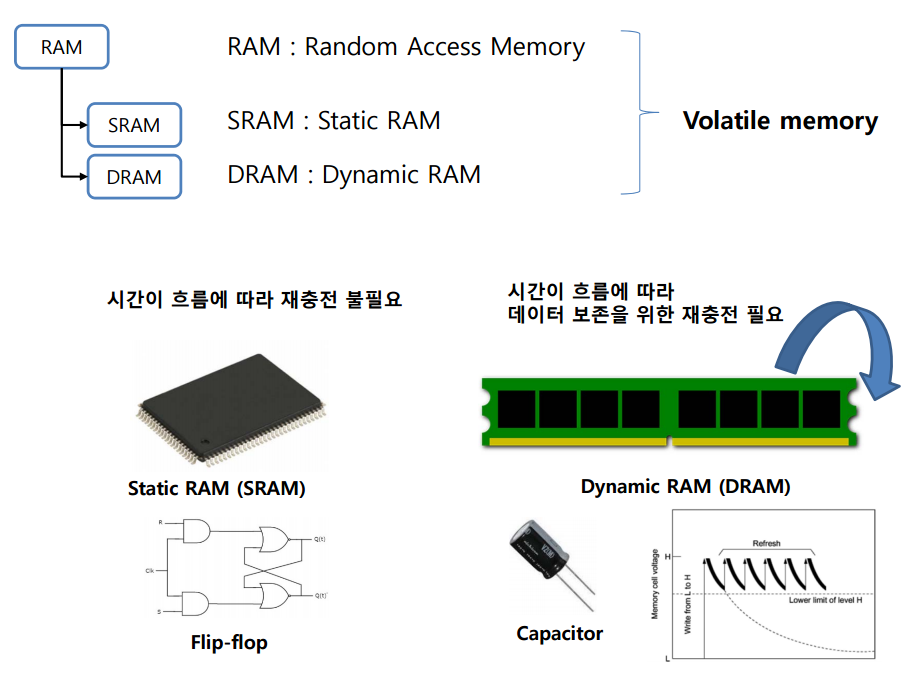
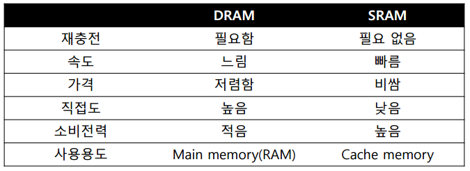
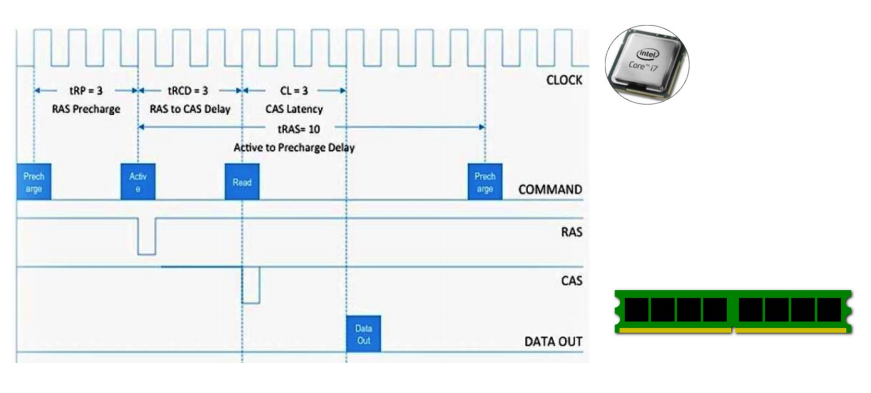
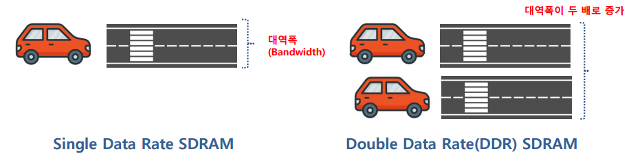

### 메모리(Memory)

---

> ♣︎ 컴퓨터 메모리

- 하드웨어적 관점으로 볼때 메모리는 총 4개

  - Register
  - cache
  - memory(Ram, Rom)
  - Secondary Storage(SSD, HDD)
     

- 저장장치는 속도가 높으면 높을수록 가격이 비싸다
  - 하드디스크에 데이터를 계속 저장하면 비용이 많이 들기 떄문에 카세트 테이프에 데이터를 저장하는 경우도 있다
    - 카세트 테이프를 시퀀셜 accese라 한다.

 

> ♣︎ 컴퓨터 메모리 종류

- Internal memory
  - 일반적으로 Main board와 직접적으로 연결되어 있는 칩(chip)이나 모둘(Module)
- External memory

  - Secondary memory 종류
     

- RAM: Random Access Memory - 내가 원하는 데이터가 있으면 바로 꺼집어 냄
- ROM: Read only Memory - 읽기전용
- sram:Register,cache
- dram:Memory

메모리에 데이터를 저장했는데 그게 시간이 지남에 따라서 바뀔수있는지(유지할수있는지)에 따라 스태틱메모리인지 다이나믹램인지 차이가남.

 

> ♣︎ 프로그램 실행 순서

- 컴퓨터를 부팅하면 실행되는 장치 순서
  - Secondart System → memory → Cashe → Register
- cache에는 갈수도 있고 안갈수도 있다.

 

> ♣︎ SRAM vs DRAM

- Static RAM: 정적 - 변하지 않는다 - 메모리에 저장된 데이터가 시간에 흐름에 따라 값이 변하지 않는다
- Dynamic RAM: 동적 - 변한다 - 메모리에 저장된 데이터가 시간에 흐름에 따라 값이 변할수 있다. 값을 계속 유지하기 위해 장치가 필요함

- SRAM : Static Ram

  - 시간이 지나도 데이터가 유지(전원이 공급되는 동안)
  - Flip-flop을 이용하여 구성(Transistor로 구성)
  - 메모리 Read/Write 속도가 빠름
  - 직접도 낮음
  - 소비전력 높음
     

- DRAM : Dynamic Ram

  - 시간이 지나도 데이터가 유지(전원이 공급되는 동안)
  - Flip-Flop을 이용하여 구성(Transistor와 Capacitor로 구성)
  - Capacitor를 사용함으로 시간이 지남에 따라 재충전 필요
  - SRAM 보다는 Read/Write 속도가 느림
  - SRAM 대비 회로도가 간단함 -> 직접도 높음
  - SRAM 대비 소비 전력 낮음
     

- 🤔직접도란?

  - 동일한 면적이라고 가정했을 때, 반도체 칩이 얼마나 많은 논리소자로 구성되어 있는지를 나타내는 척도
     

 

> ♣︎ SDRAM

- SDRAM : Synchronous Dynamic RAM
  - 클럭 신호와 동기화된 DRAM의 발전된 형태의 램
  - DRAM 대비 메모리 Read/Write 속도가 빠름
  - 동기 방식이 아닌 비동기 방식
  - SRAM과 다른점은 SDRAM은 메모리를 읽고 쓰고 할 때 동기화를 한다

 

> ♣︎ DDR SDRAM

- DDR SDRAM : Double Data Rate(DDR) Synchromous Dynamic RAM(SDRM)
  - 기존 SDR 대비 두 배의 대역폭(Bandwidth)을 가지는 메모리
  - 메모리에 직접도를 높임, 직적도가 고집적이면 발열이 발생
  - 외부와의 통신을 위해 대역폭이 필요한데 이때 필요한게 DDR
  - DRAM의 전송속도가 2배씩 늘어난다.

