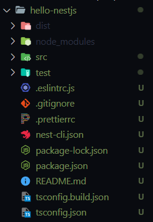
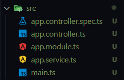
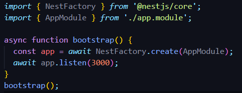
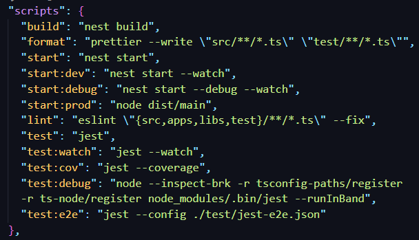

# Nest.js

## Nest.js란
Nest.js는 Node.js를 위한 프레임워크로서, 환장 가능하고 모듈화된 웹 애플리케이션을 구축하기 위한 프레임워크

## 사용방법
Nest.js는 개발의 편의성을 증대시켜주기 위한 Nest CLI를 함께 제공합니다.

### 설치방법
```js
npm i -g @nestjs/cli // Nest.js CLI 전역 설치
nest new project-name // Nest.js 프로젝트 생성
```

위에 명령어 작성시 폴더가 생성된다. <br>



여기서 주목해야 할 부분은 src 폴더 내의 파일들입니다. <br>



### src 구성요소
- app.controller.ts: GET 메소드를 한 개만 갖고 있는 기본 컨트롤러, getHello 라는 메소드가 포함되어 있다.
- app.controller.spec.ts: app.controller.ts 컨트롤러에 대한 유닛 테스트를 위한 파일이다.
- app.module.ts: 전체 어플리케이션의 루트 모듈이다.
- app.service.ts: 비즈니스 로직을 담는 기본 서비스이다. app.controller.ts 의 getHello 메소드를 처리하기 위한 비즈니스 로직이 예제로 작성되어있다.
- main.ts: Nest.js 어플리케이션 인스턴스를 생성하기 위한 NestFactory 를 사용하는 엔트리 파일이라고 한다.

 <br>

Nest.js 서버 어플리케이션을 만들기 위해서는 코어 클래스인 NestFactory 를 사용한다고 한다.

create() 메소드는 어플리케이션 객체를 반환하며, INestApplication 인터페이스의 형태를 띤다고 한다.

도큐먼트에서는 create() 메소드의 제네릭으로 NestExpressApplication 또는 NestFastifyApplication 를 작성하면 app 객체가 각각의 
프레임워크의 메소드만을 갖게 된다고한다.

### 실행방법

package.json 를 확인해본다.



**npm run start** 를 통해 실행시키면 3000번 포트로 서버가 열린다.

**npm run start:dev** 를 입력하면, 변경사항이 감지되었을 경우 직접 서버를 다시 키지 않아도 이를 감지하여 서버를 자동으로 재시동해준다.