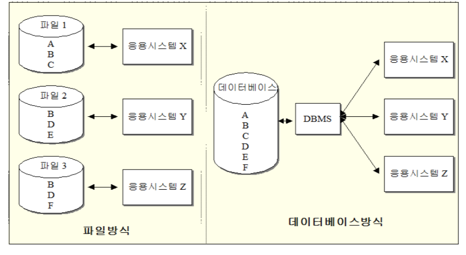

### 데이터 베이스의 역사

> ♣︎ 파일 시스템

- 컴퓨터를 이용한 데이터 저장, 괄리 및 처리의 초기 형태
- 다양한 형태의 파일시스템 사용

  - 파일 시스템의 장점 - 처리속도가 DB에 비해 빠르다 - 구현이 간편하다 - 비용이 저렴하다
     

  - 파일 시스템의 단점
    - 데이터파일과 응용프로그램의 종속성
    - 프로그램과 파일의 종속성
    - 중복 저장으로 저장 공간의 낭비 문제
    - 여러 파일에 저장된 데이터 수정 시 데이터 무결성이 침해
    - 표준화의 어려움
    - 보안 관련 문제 발생 가능성

> ♣︎ 데이터베이스

- 데이터베이스

  - 조직화된 정보의 모음 그 자체를 의미
  - 특정 조직체에 관련된 사실들을 수집하여 표준형식으로 저장된 데이터
  - 다수의 응용프로그램들이 공유할 수 있도록 설계
  - 조직에서 다양한 수준의 의사 결정을 지원하기 위한 정보를 제공
  - 방대한 양의 데이터를 구조적으로 관리
  - 많은 사용자들에 의한 동시 접근 허용
     

- 데이터베이스의 특징
  - 실시간 접근성(Real-time accessibility)
    - 사용자의 요구에 대한 즉각적은 응담(Response) 및 처리를 의미
  - 지속적인 변화(Continuous evolution)
    - 삽입, 삭제, 갱신 작업이 수시로 가능
  - 동시 공용(Concurrent sharing)
    - 여러 사용자가 동시에 하나의 데이터베이스의 동일한 데이터 접근
  - 내용에 의한 참조(Content reference)
    - 데이터를 참조할 때 데이터 레코드의 주소나 위치에 의해서가 아니라 사용자가 요구하는 데이터 내용으로 찾음

 

> ♣︎ 데이터베이스 시스템의 발전과정

- 1960년대
  - 데이터베이스에 대한 연구와 개발 시작
- 초기
  - 계층형 데이터베이스, 네트워크 데이터베이스
- 1970년대 이후
  - 관계형 데이터베이스 관리 시스템(RDBMS) 개발
- 1980년대 후반
  - 객체 지향 데이터 모델 개발
- 1990년대
  - 객체지향 관계형 DBMS로 발전
- 최근
  - RDBMS + NoSQL

### 데이터베이스 시스템

> ♣︎ 데이터베이스 시스템의 구성요소

- 데이터베이스
- DBMS
- 사용자
- 하드웨어
- 툴과 응용프로그램
- 데이터베이스 언어

> ♣︎ 데이터와 정보

- 데이터 : 컴퓨터 매체에 저장된 사실 자체
- 정보 : 데이터를 처리, 가공해서 이해하기 쉽고 의미 있게 만든 것
- 데이터를 사용자에게 유용하고 의미 있는 정보로 변환 하는 것은 응용프로그램이 담당

> ♣︎ 데이터베이스 관리시스템

- DBMS(Database Management System, 데이터베이스 관리 시스템)

  - 데이터베이스를 관리하기 위해 필요한 소프트웨어
  - 요청에 따라 데이터베이스의 데이터를 저장 및 검색 수정하는 프로그램
  - 사용자와 응용프로그램과 데이터베이스간의 인터페이스 역활을 담당하는 소프트웨어 패키지
  - 편리하고 효율적인 데이터베이스 사용 환경을 제공
  - 새로운 데이터베이스의 생성에서부터 저장된 데이에 대한 입력, 수정 등의 동시 접근 기능 제공
  - 시스템 고장으로부터 데이터를 보호
  - 사용자 액세스를 제어하는 등의 보안 기능
  - 데이터베이스를 분류할 때 DBMS의 유형에 따르는 것이 일반적
     

- DBMS의 장단점
  - 장점
    - 데이터 중복의 최소화
    - 데이터의 공유
    - 데이터의 일관성과 무결성 유지
    - 데이터의 보안 보장
    - 범기관적 표준화 가능
    - 응용프로그램 개발이 용이함
  - 단점
    - 운영비의 증대(하드웨어, 소프트웨어, 인력)
    - 자료 처리의 복잡화
    - 복잡한 백업과 복구
    - 시스템의 성능에 DBMS 성능이 의존적임

> ♣︎ 데이터베이스 언어

- 사용자와 데이터베이스 시스템 간의 통신 수단
- 관계형 DBMS는 데이터베이스 언어로 SQL을 제공
  - 대부분의 상용 관계형 데이터베이스의 표준언어
- 데이터베이스 스키마 정의
  - DBMS에서 제공하는 연산자들을 사용하여 데이터를 입력, 수정, 삭제 및 검색

> ♣︎ SQL의 기능

- 데이터 정의어(DDL)

  - 데이터베이스 스키마를 정의하거나 수정하기 위해 사용
  - CREATE / ALTER / DROP
     

- 데이터 조작어(DML)

  - 데이터베이스 내의 데이터 연산을 위한 언어
  - 데이터의 검색 및 삽입, 삭제, 갱신 작업 수행
  - SELECT / INSERT / UPDATE / DELETE
     

- 데이터 제어어(DCL)
  - 데이터베이스 트랙잭션을 명시하고 권한부여 및 취소
  - 주로 DBA가 사용
  - GRANT / REVOKE

> ♣︎ 데이터베이스 사용자

- 일반 사용자

  - 제한적인 삽입, 삭제, 갱신 작업을 수행
     

- 응용 프로그래머

  - 여러 형태의 언어와 데이터 조작어를 이용하여 데이터베이스를 접근
  - 특정 응용프로그램 또는 인터페이스의 구현
     

- 데이터베이스 관리자(DBA)
  - 데이터베이스 설계와 운영
  - 사용자의 요구와 불평 해결
  - 시스템 감시 및 성능 분석

> ♣︎ 데이터베이스 사용자

- 데이터베이스 서버

  - 컴퓨터에 DBMS를 설치하고 데이터베이스를 생성한 후위의 컴퓨터
     

- 하드웨어의 사양과 요구사항을 사전 검토 및 데이터베이스를 운영하는 동안에도 주기적 체크 필요
  - 하드 디스크의 용량은 데이터베이스의 용량과 밀접한 연관
  - 하드 디스크의 I/O 속도 및 메모리와 CPU는 데이터베이스 성능과 밀접한 관계

🧐 **I/O란? 입력(Input) / 출력(Output)의 약자로, 컴퓨터 및 주변장치에 대하여 데이터를 전송하는 프로그램, 운영 혹은 장치를 일컫는 말**
