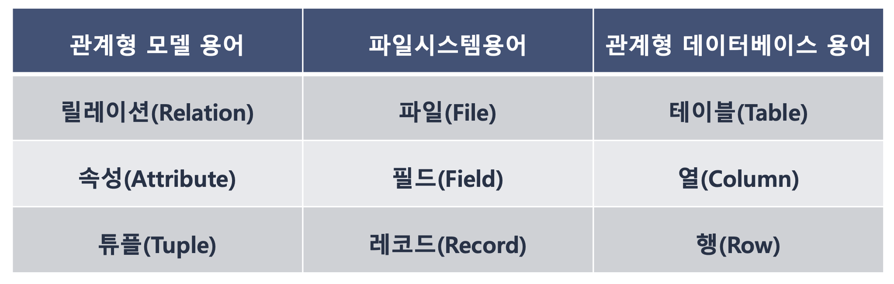
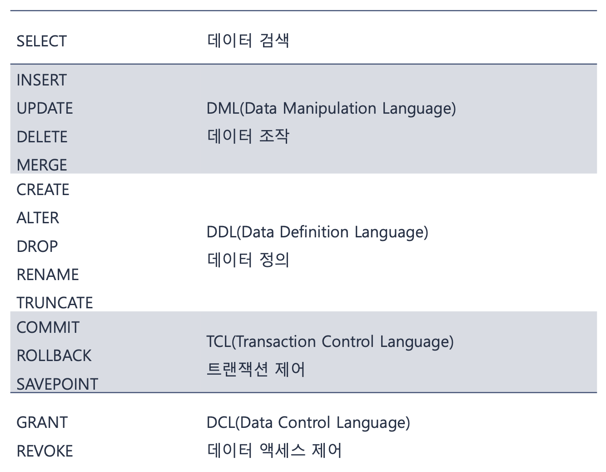
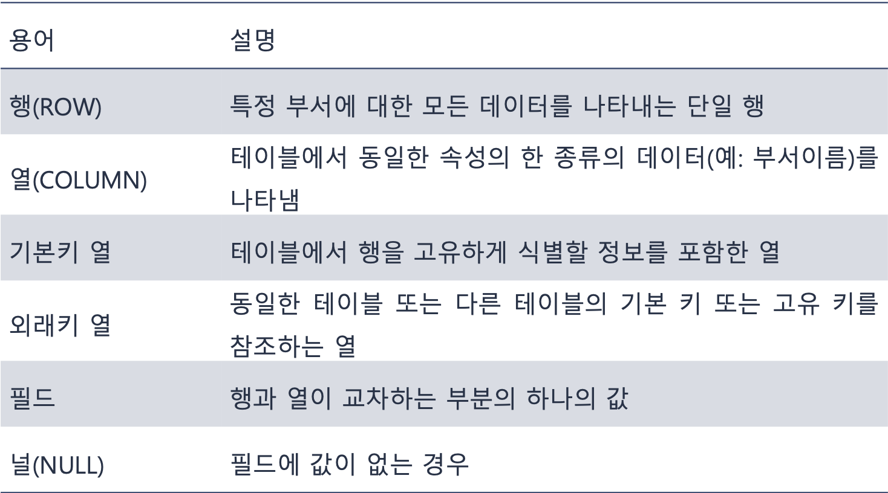
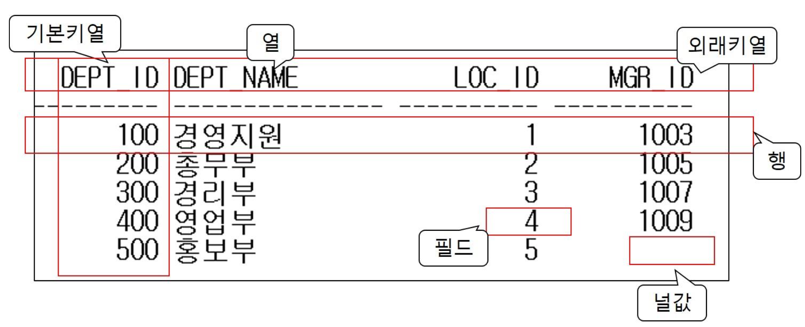

### 관계형 데이터베이스

> ♣︎ 관계형 데이터베이스란?

- E.F.Codd(에드거 F. 커드) 가 제창한 관계모델에 입각한 데이터베이스
- 2차원 테이블 형태의 구조에 데이터를 저장하는 객체 또는 릴레이션의 모음
- 구조가 사용하기 쉽고 융통성이 있어서 현재 대부분의 상용 데이터베이스의 기반
- 오라클과 같은 기업에서 종합적인 솔루션을 제공하는 강력한 응용 프로그램군과 사용자 제품을 함께 개발

> ♣︎ 관계형 데이터모델의 릴레이션의 개념

- 튜플(tuple)과 속성(attribute)으로 구성된 2차원 테이블 구조
- 특정 엔티티와 관련된 정보를 저장
- 속성
  - 릴레이션에서 관리하는 구체적인 정보 항목
  - 릴레이션에서 이름을 가진 하나하나의 열을 의미
- 튜플
  - 릴레이션의 각 행으로 릴레이션이 표현하는 엔티티의 특정 사실 또는 값들의 모임

> ♣︎ 릴레이션스키마와 인스턴스

- 릴레이션 스키마

  - 릴레이션의 이름과 속성의 집합
  - 시간이 흘러도 변경되지 않는 정적인 특징
     

- 릴레이션 인스턴스
  - 특정시점에 릴레이션에 저장된 튜플의 집합
  - 시간의 흐름에 따라 릴레이션의 인스턴스는 변경
  - 릴레이션은 항상 현재의 인스턴스만 저장

> ♣︎ 관계형 데이터베이스의 특징

- 관계 또는 2차원 테이블을 사용하여 정보를 저장한다.
- 사용자는 테이블에 대한 액세스 경로를 지정하지 않으며 데이터가 물리적으로 배열되어 있는 방식을 알 필요가 없다.
- 데이터베이스를 액세스하려면 관계형 데이터베이스를 사용기 위한 ANSI(American National Standards Institute) 표준어인 SQL 문을 실행해야 한다.
- SQL 문에는 연산자 집합이 포함되어 있으며, 데이터베이스는 SQL 문을 사용하여 검색 또는 수정할 수 있다.

### 오라클 데이터베이스

- 관계 데이터 모델(Relational Data Model)을 지원하는 관계형 데이터베이스 시스템 또는 객체지향 관계형 데이터베이스 시스템
- 높은 시장 점유율과 신뢰성을 지닌 데이터베이스 관리 시스템
- 다양한 하드웨어와 유닉스, 리눅스, 윈도우 등 대부분의 운영체제 플랫폼을 지원
- 구조화된 일반적인 데이터뿐 아니라 텍스트, 공간, 이미지, 소리, 비디오, 일련의 시간 등 모든 유형의 데이터를 처리하고 관리

> ♣︎ 오라클의 설치 유형

- Oracle Database 11g Express Edition

  - Oracle 11g의 무료 배포 제품
  - 교육센터나 일반 기업체에서 라이센스없이 사용 가능한 제품
     

- Oracle Standard Edition

  - 적은 수의 다중 사용자를 지원하며 소규모 환경에 적합
  - 설치 가능한 플랫폼이 제한적
     

- Oracle Enterprise Edition
  - 대규모 데이터베이스를 위한 고급관리, 네트워킹, 데이터 웨어하우징 기능 포함
  - 대부분의 플랫폼 지원하며 특정 목적을 위한 다양한 옵션 가능

🧐 **데이터 웨어하우스란 사용자의 의사 결정에 도움을 주기 위하여 기간시스템의 데이터베이스에 축적된 데이터를 공통의 형식으로 변환해서 관리하는 데이터베이스를 말한다.**

> ♣︎ SQL

> ♣︎ 오라클 데이터베이스 계정

- **SYS**
  - 데이터베이스의 슈퍼유저로 데이터베이스의 생성, 시작과 종료 및 전반적인 데이터베이스 관리가 가능한 사용자
- **SYSTEM**
  - 시작되어 있는 데이터베이스에서 대부분의 일상적인 관리업무가 가능한 사용자
- **SCOTT**
  - Oracle 8i 릴리스까지 유일한 샘플 스키마
- **HR**
  - Oracle 9i 릴리스 이후 다양한 샘플 스키마 중의 하나

> ♣︎ SQL 작성사용 도구

- SQL\*Plus

  - 오라클 제공의 대표적 Command Line Interface의 SQL 작성 도구
     

- SQLDeveloper
  - 오라클에서 제공하는 통합 개발자 도구
  - 추가 설치 필요

> ♣︎ 테이블관련 용어

