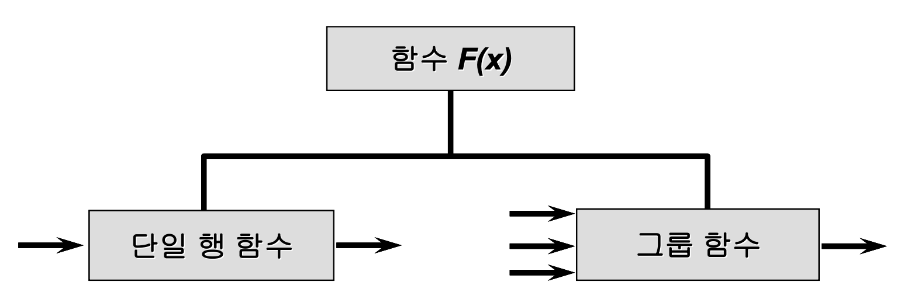
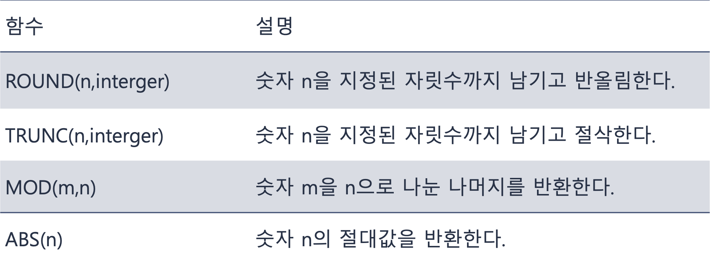
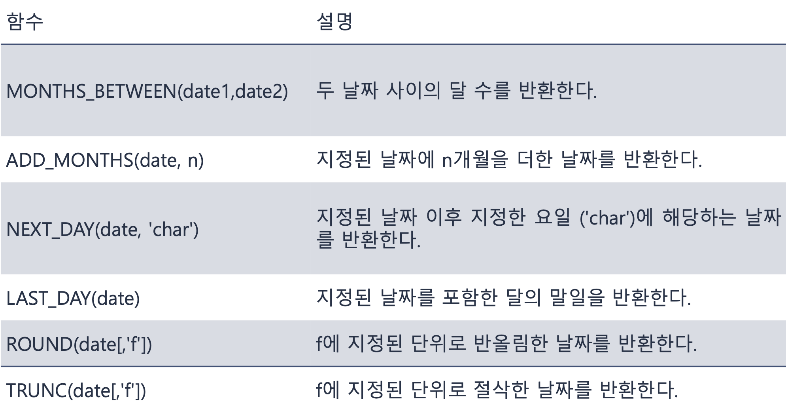

## 단일행 함수

---

> ♣︎ 함수의 개념

- 인수를 입력하면 함수가 적용된 결과를 반환
- 함수의 용도
  - 데이터에 대해 계산을 수행할 경우
  - 각각의 데이터 항목을 변경할 경우
  - 출력할 날짜 형식을 변경할 경우
  - 출력할 숫자에 형식을 지정할 경우
  - Column의 데이터 유형을 변경할 경우
  - 행 그룹의 결과를 출력할 경우

> ♣︎ 함수의 종류

- 하나의 결과를 출력하기 위해 사용되는 인수의 개수에 따라 구분
<p align="center"></p>

구문

```
function_name[(인수1, 인수2,...)]
```

> ♣︎ 단일행 함수

- 데이터를 조작해 보거나 데이터 유형 수정 가능
- 열 이름 또는 표현식이 인수
- 단일행 함수의 종류
  - 문자함수
  - 숫자함수
  - 날짜함수
  - 변환함수
  - 일반함수

> ♣︎ 문자함수

- 문자를 입력 값으로 받으며 문자 또는 숫자 값을 반환
- 대소문자 조작 함수
  - LOWER(char) : 대소문자 또는 대문자 문자열을 소문자로 변환
  - UPPER(char) : 대소문자 또는 소문자 문자열을 대문자로 변환
  - INITCAP(char) : 각 단어의 첫 문자는 대문자로, 나머지 문자는 소문자로 변환

예시

```
SELECT LOWER('Oracle Database') as 소문자
FROM dual; // 실행결과 : oracle database

SELECT UPPER('Oracle Database') as 대문자
FROM dual; // 실행결과 : ORACLE DATABASE

SELECT INITCAP('oracle database') as 첫문자대문자
FROM dual; // 실행결과 : Oracle Database
```

- 문자 조작 함수 1

  - CONCAT(char1, char2) : 지정된 두 문자를 결합한다.
  - SUBSTR(char, m, [n]) : 지정된 길이의 문자열을 반환한다.
  - INSTR(char1, char2, [m], [n]) : 지정된 문자가 존재하는 위치를 숫자로 표시한다.
  - LENGTH(char) : 문자의 개수를 반환
    <br>

- 문자 조작 함수2
  - LPAD(char1, n, [char2]) : 전체 길이 n에 대하여 char1을 오른쪽 정렬하고 빈 곳을 char2로 채운다.
  - RPAD(char1, n, [char2]) : 전체 길이 n에 대하여 char1을 왼쪽 정렬하고 빈 곳을 char2로 채운다.
  - REPLACE(char1, str1, str2) : 문자열의 특정 문자를 다른 문자로 변환
  - TRIM(char2 FROM char1) : char1의 접두어 또는 접미어에 해당하는 char2를 잘라낸다.
  - LTRIM(char2 FROM char1) char1의 온쪽에서 char2를 제거한다.
  - RTRIM(char1, char2) : char1의 오른쪽에서 char2를 제거한다.

예제1

```
SELECT CONCAT(CONCAT(emp_name, ' '), position)
FROM y_emp; // 입력데이터 : 송강호,사장 실행결과 : 송강호 사장

SELECT SUBSTR('Computer Information', 10, 4)
FROM dual; // 실행결과 : Info

SELECT INSTR(email, 'a')
FROM y_emp; // 입력데이터 : hwangsh 실행결과 : 3

SELECT RPAD(emp_name, 12, '*')
FROM y_emp; // 입력데이터 : 하정우 실행결과 : 하정우******

SELECT LPAD(emp_name, 10, '*')
FROM y_emp; // 입력데이터 : 송강호 실행결과 : ****송강호
```

예제2

```
SELECT REPLACE('010.1234.5678', '.', '-')
FROM dual; // 실행결과 : 010-1234-5678

SELECT LTRIM('ababaaaBaXXXAbbbabab', 'ab')
FROM dual; // 실행결과 : BaXXXAbbbabab

SELECT RTRIM('ababaaaBaXXXAbbbabab', 'ab')
FROM dual; // 실행결과 : ababaaaBaXXXA

SELECT TRIM('w' FROM 'window')
FROM dual; // 실행결과 : indo
```

> ♣︎ 숫자함수

- 숫자를 인수로 사용하며 결과로 숫자를 반환
<p></p>

> ♣︎ ROUND와 TRUNC

- 주어진 숫자에 특정 자릿수 이하를 반올림 또는 버림
- 자릿수에 지정하는 수
  - 0 또는 지정이 되지 않으면 일의 자리
  - 양수이면 소수점 아래
  - 음수이면 소수점 위의 자리

```
SELECT ROUND(56.835,2), ROUND(56.834, 0), ROUND(56.834, -1)
FROM dual; // 출력결과 : 56.84, 56, 60

SELECT TRUNC(56.835, 2), TRUNC(56.834, 0), TRUNC(56.834, -1)
FROM dual; // 출력결과 : 56.83, 56, 50

SELECT emp_name, salary, MOD(salary, 50)
FROM y_emp
WHERE dept_id = 300; // 300번 부서에서 근무하는 모든 사원에 대한 급여에 50으로 나눈 나머지 출력
```

> ♣︎ 날짜 함수

- 날짜를 인수로 사용하며 날짜 또는 숫자를 결과로 반환
<p></p>

```
SELECT MONTHS_BETWEEN(SYSDATE, hiredate), hiredate
FROM y_emp; // 현재시간과 hiredate 와의 달 수를 출력

SELECT ADD_MONTHS(SYSDATE, 3)
FROM dual; // 현재시간에서 3개월을 더한 값 출력

SELECT NEXT_DAY(SYSDATE, '월') 월요일
FROM dual; // 현재시간에서 가장 가까운 월요일 출력

SELECT LAST_DAY(SYSDATE)
FROM dual; // 현재달이 몇일까지 있는지 반환
```

- ROUND와 TRUNC
  - 날짜를 가장 가까운 연도 또는 달로 반올림하거나 절삭
  - 자릿수 대신 날짜의 단위에 해당하는 형식모델을 지정
  - 지정 가능한 형식모델
  <p></p>

```
SELECT emp_id, hiredate, MONTHS_BETWEEN(SYSDATE, hiredate) 근무기간,
       ADD_MONTHS(hiredate, 3) 수습종료일, NEXT_DAY(hiredate, '금요일'),
       LAST_DAY(hiredate)
FROM y_emp
WHERE position = '사원'; // 직급이 사원인 사원들의 사원번호, 입사일, 근무한 달 수, 입사 후 수습종료일, 입하 후 첫 금요일 및 입사한 달 출력

SELECT emp_id, REPLACE(hiredate, '/', '-'), ROUND(hiredate, 'MONTH'),
       TRUNC(hiredate, 'MONTH')
FROM y_emp
WHERE hiredate LIKE '05%'; // ROUND는 반올림을 해서 15일 이상이면 다음달 1일로 출력 TRUNC는 버림이므로 그달 1일로 출력
```

> ♣︎ 데이터 유형의 변환

- 암시적(implicit) 데이터 유형 변환

  - 오라클 서버에 의해 자동으로 수행되는 데이터 유형 변환
    <br>

- 명시적(explicit) 데이터 유형 변환
  - 변환 함수를 사용하여 사용자의 의해 수행되는 데이터 유형 변환
  - SQL 문의 신뢰성과 가독성을 높이기 위해서 권장되는 방법
    <br>

> ♣︎ 변환함수

- SQL은 값의 데이터 유형을 변환하는 세 가지 함수 제공
  - TO_CHAR
  - TO_DATE
  - TO_NUMBER
  <p></p>

```
SELECT emp_name, position, LPAD(salary, 10, '*'), email
FROM y_emp
WHERE email LIKE '%k%'; // 양 끝이나 중간에 이메일에 k가 들어간 salary의 빈곳에 '*' 10개 추가

SELECT *
FROM y_dept
WHERE dept_id = ‘100’; // 타입 에러
```

> ♣︎ TO_CHAR 함수

- 숫자 또는 날짜 데이터를 문자 데이터로 변환할 때 사용
- 구문

```
TO_CHAR([숫자 | 날짜] , 'format_model')
```

> ♣︎ 숫자 데이터에 TO_CHAR 함수의 사용

- 숫자 데이터를 사용자가 지정하는 형식으로 변환
  - 숫자 데이터에 통화기호나 자릿수 구분기호를 추가하여 출력
- 형식 요소
<p></p>

- 기본 형식의 날짜 데이터를 사용자가 지정하는 날짜 형식 으로 변환

날짜 관련 형식요소 1

<p></p>

날짜 관련 형식요소 2

<p></p>

```
SELECT emp_id, emp_name,
       TO_CHAR(salary*12, 'L99,999.00') ANNUAL_SALARY
FROM y_emp
WHERE dept_id = 100; // salary * 12한 값을 'L' 지역통화 기호로 바꾸어 주고 99.999로 자리수를 나타내고 0으로 전체 자리수를 나타낸다

SELECT emp_id, emp_name, hiredate,
       TO_CHAR(hiredate,'yyyy-mm-dd')
FROM y_emp
WHERE dept_id = 200; // 04년 01월 01일 yyyy의 형식으로 나타내면 2004 mm의 형식으로 나타내면 01 dd형식으로 나타내면 01로 출력

SELECT TO_CHAR(SYSDATE, 'yyyy/mm/dd HH:MI:SS AM')
FROM dual; // 출력결과 : 2023/04/15 07:16:45 오전 현재 시간까지 출력
```

> ♣︎ TO_NUMBER 함수의 사용

- 사용자가 인수로 지정한 데이터의 형식요소를 제거하면 숫자가 되는 값에 인수의 형식을 명시
- 구문

```
TO_NUMBER(‘char’ [, 'format_model'])
```

- 문자인 첫 번째 인수도 작은 따옴표 필요
- 형식요소를 제거했을 때 숫자가 되는 데이터만 유효

> ♣︎ TO_DATE 함수의 사용

- 지정되는 데이터를 날짜로 변환

  - 입력되는 인수와 형식요소에 날짜와 관련된 값들만 사용
    <br>

- 기본 날짜 형식과 일치하지 않는 날짜를 오라클이 날짜가 아닌 문자로 처리해서 검색에 실패하는 경우 사용
- 구문

```
TO_DATE(‘char’[, 'format_model'])
```

```
SELECT emp_id, emp_name, position, dept_id
FROM y_emp
WHERE salary*12 > TO_NUMBER('10,000','99,999');
// 연봉이 1억 이상인 사원을 검색하는 쿼리문으로 WHERE 절에서 비교조건인 10,000을 TO_NUMBER 함수를 사용하여 숫자 10000으로 변환하여 비교

SELECT emp_id, emp_name, birthdate
FROM y_emp
WHERE birthdate >= TO_DATE('01-01-1992','dd-mm-yyyy');
```

> ♣︎ RR과 YY 형식요소

- 사용자가 연도를 두 자리만 입력하면 오라클은 자동으로 연도 앞에 세기를 추가하여 검색 하는 방식
  - YY날짜 형식요소는 현재 날짜와 같은 세기ㅏ정보를 사용하는 형식
  - RR날짜 형식요소는 사용자가 지정한 날짜의 두 자리 연도와 현재 연도의 마지막 두 자리에 따라 오라클에 인식되는 세기 값이 달라지는 형식
    - RR 형식 요소는 현재 연도가 0 ~ 49년 사이일 때 인수로 사용되는 데이터가 50 ~ 99 년 사이의 값을 가지면 이전세기를 사용하는 날짜 형식
    - 연도 두 자리만 지정해서 처리하는 많은 응용프로그램에서 21세기에 20세기 데이터를 처리하는 동안 유용하게 사용

```
TO_CHAR(salary*12, 'L99,999.00')➔₩11,160.00  TO_CHAR(hiredate,'yyyy-mm')➔2004-01
TO_NUMBER('10,000', '99,999')
TO_DATE('01-01-1992', 'DD-MM-YYYY')
```

```
SELECT emp_id, emp_name, birthdate
FROM y_emp
WHERE birthdate >= TO_DATE('01-01-1992','DD-MM-YYYY'); // 1992년 1월 1일 이후에 태어난 사원을 검색하고자 할 때 다음과 같이 TO_DATE함수를 사용

SELECT emp_id, emp_name, birthdate
FROM y_emp
WHERE birthdate > TO_DATE('01/01/92','dd-mm-rr'); // 위 예제에서 이전 세기에 해당되는 1992년을 연도 두자리만으로 검색하기 위해서는 RR형식을 사용해야함
```

### 함수의 중첩

- 단일 행 함수는 여러 번 중첩가능
- 가장 안쪽부터 바깥쪽 순으로 계산

```
SELECT emp_id,
       REPLACE(emp_name, SUBSTR(emp_name, 2, 4),'***') name,
       CONCAT(birthdate,CONCAT('[',CONCAT(gender,']'))) AS birth
FROM y_emp
WHERE SUBSTR(emp_name, -1, 1) = '영';
// 이름이 '영'으로 끝나는 사원들중 이름의 두번째 문자로 부터 세 문자를 '*'로 표시하고
   생년월일과 특수문자'[]'및 gender 열을 결합하여 생년월일 옆에 성별을 표시

SELECT emp_id, emp_name, TO_CHAR(hiredate, 'yyyy/mm/dd'),
       TO_CHAR(NEXT_DAY(ADD_MONTHS(hiredate, 6),'금요일'),'yyyy/mm/dd')
       AS "Review_Day"
FROM y_emp
WHERE TO_CHAR(hiredate, 'yyyy') LIKE '2011%';
// 입사 후 6개월 경과 후 첫 번째 돌아오는 금요일이 사원의 인턴기간이 만료되고
   채용여부가 결정되는 시기로 정해져 있다.2011년에 입사한 사원의 인턴기간 만료일이 언제인지 출력
```

### 일반함수

- 표현식에 NULL 값을 비롯한 모든 데이터유형의 값을 사용할 수 있는 함수
- 사용 가능한 일반함수의 종류는 수 백 가지에 이를 만큼 방대
- 함수에 대한 자세한 내용은 Oracle SQL Reference Guide 참조
- 일반함수 종류의 예
  - NVL(expr1, expr2)
  - NVL2(expr1, expr2, expr3)
  - NULLIF(expr1, expr2)
  - COALESCE(expr1, expr2, ..., exprn)

> ♣︎ NVL 함수

- NULL 값을 실제 값으로 변환해주는 함수
- 구문

```
NVL (표현식1, 표현식2)
```

- 표현식1 : NULL을 포함하는 열 이름 또는 포현식
- 표현식2 : NULL 값을 변환할 대상 값
- 표현식2의 데이터유형은 표현식1의 데이터유형과 동일

> ♣︎ NVL2 함수

- 표현식1이 NULL이 아닌 경우 표현식2를 반환
- 첫번째 표현식이 NULL인 경우, 표현식3을 반환
- 구문

```
NVL2(표현식1, 표현식2, 표현식3)
```

> ♣︎ NULLIF 함수

- 두 표현식을 비교한 결과
  - 동일한 경우 NULL을 반환
  - 동일하지 않은 경우 첫 번째 표현식(expr1)을 반환
- 구문

```
NULLIF (표현식1, 표현식2)
```

> ♣︎ COALESCE 함수

- 표현식1이 NULL이 아닌 경우 해당 표현식을 반환하며
- 표현식 1이 NULL인 경우에는 나머지 표현식에 대해 COALESCE 함수를 계속 적용하여 인수의 목록에서 처음으로 NULL이 아닌 값을 반환
- COALESCE 함수는 인수의 개수에 제한이 없음
- 구문

```
COALESCE (표현식1, 표현식2, ... 표현식n)
```

> ♣︎ 일반함수 사용 예제

```
NVL(hiredate, sysdate)
NVL(comm, 0)
NVL2(comm,'Y','N')
NULLIF(LENGTH(emp_name), 3)
COALESCE(comm, salary, 0)
```

```
SELECT emp_name, salary, comm,
       (salary*12) + (salary*12*NVL(comm, 0)) AS ANN_SAL
FROM y_emp; // NVL함수는 표현식1의 값이 null이면 표현식2로 바꾸어 주는 것이기 떄문에 표현식2가 0이므로 null인값은 salary*12의 값 출력

SELECT emp_name, salary, comm, (salary*12)+(salary*12*NVL(comm,0)) ANN_SAL,
       NVL2(COMM,'SAL+COMM','SAL') AS BIGO
FROM y_emp; // NVL2함수는 널이 아닌 경우 SAL+COMM 반환 널인경우 SAL 반환

SELECT emp_id, emp_name, NULLIF(LENGTH(emp_name), 3) RESULT
FROM y_emp; // 이름의 길이가 3이면 NULL을, 3이 아니면 이름의 길이 출력

SELECT emp_id, emp_name, comm, salary,
       COALESCE(comm, salary, 0) AS COALESCE
FROM y_emp; // comm이 널이면 salary반환 comm이 널이 아니면 자신 반환 만약 comm과 salary 둘다 널이면 0반환
```

### 조건표현식

- 오라클의 SQL 문 안에서 조건 처리(IF-THEN-ELSE 논리)구현
  - DECODE 함수
    - DECODE는 오라클 8i 이전 버전에서 사용하던 전용 구문
  - CASE 표현식
    - ANSI SQL

> ♣︎ DECODE 함수

- 프로그래밍의 IF-THEN-ELSE 구문과 비슷한 기능을하는 SQL 함수
  - 첫 번째 인수에 해당하는 표현식을 각 search 값과 비교한 후 표현식이 search 값과 동일하면 해당 result 값을 반환
  - 기본값(default)은 모든 조건에 맞지 않는 데이터에 적용
  - 기본값이 생략되면 모든 search 값을 만족하지 않는 데이터는 NULL값을 반환
- 구문

```
DECODE(col|표현식, search1, result1
                 [, search2, result2,...,]
                 [, default])
```

> ♣︎ CASE 표현식

- CASE로 시작하고 END로 종료
  - WHEN ... THEN 절의 표현식과 조건이 일치할 경우 결과 반환
  - WHEN ... THEN 쌍은 여러 번 지정 가능
  - WHEN 절의 조건에 없고 ELSE 절이 존재하는 경우, ELSE 절의 지정값(elxe_expr) 반환하고 ELSE 절이 없으면 조건에 일치하지 않는 데이터는 NULL을 반환
- 구문

```
CASE 표현식 WHEN 비교 표현식1 THEN 결과1 [WHEN 비교 표현식2 THEN 결과2
WHEN 비교 표현식n THEN 결과n
ELSE else_expr] END
```

```
SELECT emp_name, position, salary,
       DECODE(position, '사원', 1.05*salary,
                        '대리', 1.07*salary,
                        '과장', 1.1*salary,
                        salary) AS INCREASED_SALARY
FROM y_emp; // 직급이 사원이면 5%인상 대리이면 7%인상 과장이면 10% 인상

SELECT emp_id, emp_name, salary,
       DECODE(TRUNC(salary / 300), 0, 'C',
                                   1, 'B',
                                      'A') AS SALARY_LEVEL
FROM y_emp; // 급여를 300으로 나누었을때 몫이 0이면 'C' 1이면 'B' 둘다 아니면 'A' 출력

SELECT emp_name, position, salary,
       CASE position WHEN '사원' THEN 1.05*salary
                     WHEN '대리' THEN 1.07*salary
                     WHEN '과장' THEN 1.1*salary
                     ELSE salary
       END AS INCREASED_SALARY
FROM y_emp; // 직급이 사원이면 5%인상 대리이면 7%인상 과장이면 10% 인상

SELECT emp_id, emp_name, salary,
       CASE WHEN salary < 300 THEN 'C'
            WHEN salary >= 300 AND salary < 600 THEN 'B'
            ELSE 'A'
       END AS SELARY_LEVEL
FROM y_emp; // 급여가 300미만이면 'C' 300이상 600미만이면 'B' 둘다아니면 'A'
```
